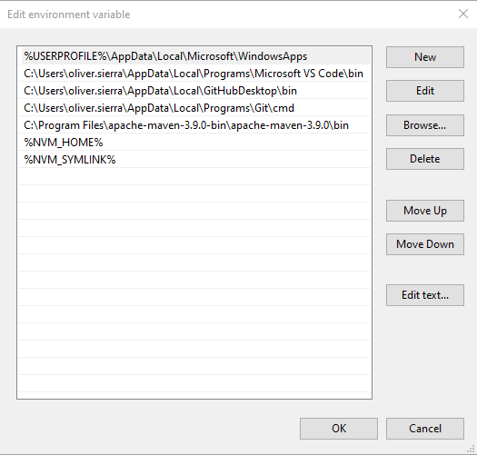

# NVM WITHOUT ADMIN RIGHTS

## 1. Install NVM-noinstall

You need to download NVM-noinstall to use it.

* [nvm-noinstall.zip](https://github.com/coreybutler/nvm-windows/releases)


Unzip the downloaded file in the following path:

**c:\tools\nvm**

Create a folder named nodejs inside the nvm folder

**c:\tools\nvm\nodejs**

The folder should look like


## 2. Set Enviroment Variables

you can press "Windows+R" and run

```bash
sysdm.cpl
```

Then go to Advanced and click on "Environment Variables".


* Variavle name: NVM_HOME
* Variable value: C:\tools\nvm


* Variavle name: NVM_SYMLINK
* Variable value: C:\tools\nvm\nodejs

This is what the final result should look like


Now you must double click on path and add:



## 3. Creating the settings file

You must create a file called "settings" in the following location

**c:\tools\nvm**

It is important to note that windows does not display the file extension, so it should look like this:


The file must contain the following information

```
root: C:\tools\nvm 
path: C:\tools\nvm\nodejs
arch: 64 
proxy: none
```

## 4. Developer mode (admin rights needed)

In order to use NVM without administrator permissions you must enable developer mode in windows:


## 5. Use NVM

You can now use NVM without administrator permissions

```bash
nvm list
nvm install LTS
nvm use LTS
```
